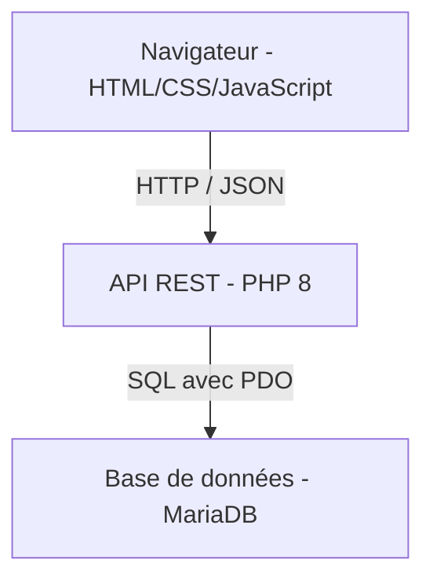

# Mission 8 - Architecture technique

## Frontend

**Technologies :** HTML5, CSS3 et JavaScript.

**Pourquoi ce choix :** ces technologies sont adaptées au niveau BTS SIO et permettent de créer une interface web responsive sans ajouter la complexité d'un framework. JavaScript utilisera `fetch()` pour communiquer avec l'API.

## Backend

**Technologie :** PHP 8.

**Pourquoi ce choix :** PHP permet de développer rapidement une API REST, de gérer les sessions et de communiquer facilement avec MariaDB grâce à PDO. Cette technologie est déjà connue et reste réaliste pour un développement de trois semaines.

## Base de données

**Technologie :** MariaDB, compatible MySQL.

**Pourquoi ce choix :** la base contient des données fortement liées : utilisateurs, équipes, tournois et matchs. Une base relationnelle permet de représenter ces relations avec des clés primaires, des clés étrangères et des contraintes d'intégrité.

## Communication frontend/backend

**Méthode :** API REST utilisant HTTP et le format JSON.

- Le frontend envoie des requêtes `GET`, `POST`, `PUT` et `DELETE`.
- L'API PHP contrôle les données et exécute les requêtes SQL.
- L'API répond avec des données JSON et un code HTTP adapté.

## Schéma de l'architecture



## Organisation envisagée

```text
plateforme-esport-sio/
├── frontend/
│   ├── index.html
│   ├── css/
│   └── js/
├── backend/
│   ├── api/
│   ├── config/
│   ├── controllers/
│   └── models/
├── docs/
├── database/
├── .gitignore
└── README.md
```
